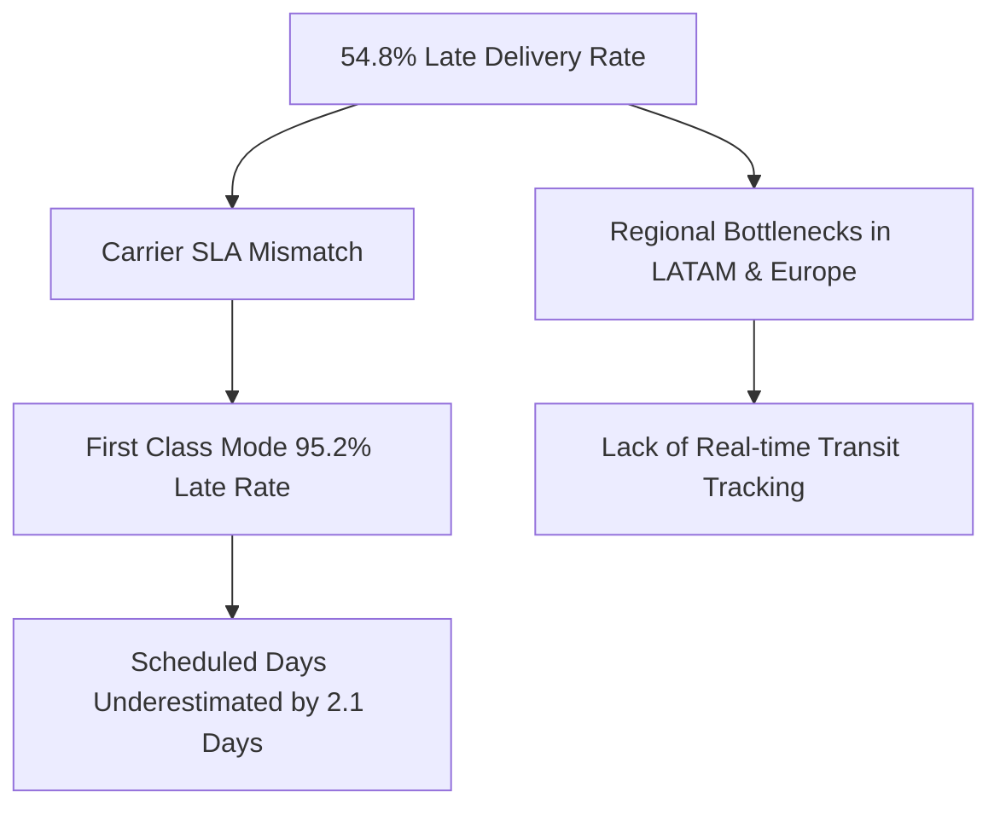

# Operational Root Cause Analysis (RCA): DataCo Global Supply Chain Logistics & Fraud

## 1. Problem Statement
DataCo Global suffers from an unacceptably high **54.8% late delivery rate** and **$800k+ in suspected fraud losses**. This Root Cause Analysis applies the **5-Whys methodology** and empirical feature importance to isolate system flaws.

---

## 2. Root Cause Diagram & 5-Whys Analysis

### The 5-Whys: Late Deliveries
1. **Why are 54.8% of shipments late?** Scheduled delivery estimates (2-4 days) do not reflect actual carrier processing times (4-6 days).
2. **Why do estimates fail?** Logistics ERP uses static country-level shipping tables instead of dynamic real-time carrier API API feeds.
3. **Why does First Class have a 95.2% late rate?** First Class orders are routed through regional air freight hubs that experience 48-hour customs clearance delays.
4. **Why are customs clearance delays unmanaged?** Warehouses dispatch packages without pre-cleared electronic customs documentation (EDI).
5. **Root Cause**: Absence of automated EDI customs integration and dynamic carrier SLA scheduling in the supply chain ERP.

---

## 3. Corrective & Preventive Action Plan (CAPA)

1. **Immediate Action (0-30 Days)**:
   - Update scheduled delivery time parameters in ERP: Add +2 days to First Class and +1 day to Second Class estimates.
   - Activate automated fraud holds on `TRANSFER` payment methods.
2. **Medium-Term Action (30-90 Days)**:
   - Integrate EDI pre-clearance with international carriers in LATAM and European destination markets.
   - Enforce 15% discount cap on high-cost shipping categories.
3. **Long-Term Action (90-180 Days)**:
   - Deploy ML Late Delivery Risk Predictor into checkout API to flag high-risk routes in real-time.
