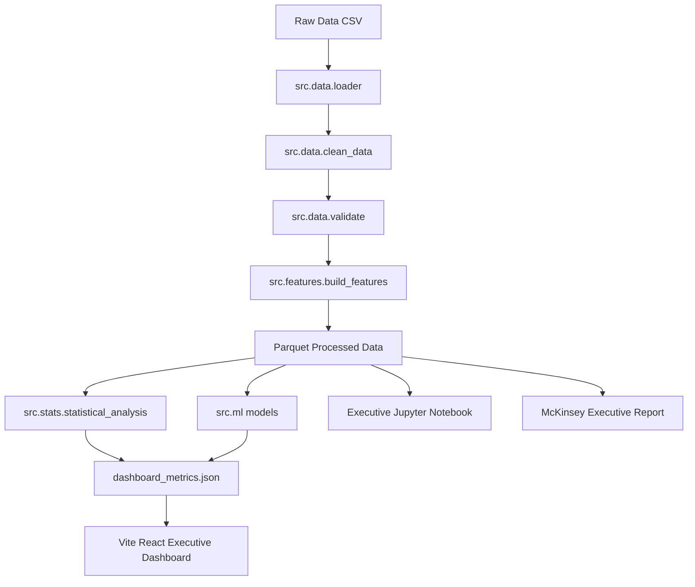

# Spec-Driven Development (SDD): Technical Architecture

## 1. Directory Structure
```
DataCo Global Supply Chain analysis/
├── data/
│   ├── raw/
│   │   ├── DataCoSupplyChainDataset.csv
│   │   ├── DescriptionDataCoSupplyChain.csv
│   │   └── tokenized_access_logs.csv
│   └── processed/
│       ├── clean_dataco_dataset.parquet
│       ├── feature_engineered_dataset.parquet
│       └── dashboard_metrics.json
├── specs/
│   ├── project_specification.md
│   ├── business_requirements.md
│   ├── data_analysis_plan.md
│   ├── technical_architecture.md
│   ├── dashboard_design.md
│   ├── tasks.md
│   └── validation_checklist.md
├── src/
│   ├── __init__.py
│   ├── data/
│   │   ├── __init__.py
│   │   ├── loader.py
│   │   ├── clean_data.py
│   │   └── validate.py
│   ├── features/
│   │   ├── __init__.py
│   │   └── build_features.py
│   ├── stats/
│   │   ├── __init__.py
│   │   └── statistical_analysis.py
│   ├── ml/
│   │   ├── __init__.py
│   │   ├── late_delivery_model.py
│   │   ├── profit_model.py
│   │   ├── fraud_model.py
│   │   ├── customer_segmentation.py
│   │   └── demand_forecasting.py
│   └── utils/
│       ├── __init__.py
│       └── logger.py
├── dashboard/
│   ├── package.json
│   ├── vite.config.js
│   ├── tailwind.config.js
│   ├── src/
│   │   ├── main.jsx
│   │   ├── App.jsx
│   │   ├── index.css
│   │   ├── components/
│   │   └── pages/
├── notebooks/
│   └── 01_DataCo_Executive_Supply_Chain_Analytics.ipynb
├── reports/
│   ├── executive_report.md
│   └── root_cause_analysis.md
├── tests/
│   ├── __init__.py
│   └── test_pipeline.py
├── requirements.txt
└── README.md
```

## 2. Component Design & Data Flow


## 3. Python Coding Standards
- **Type Annotations**: All functions must include Python type hints (`df: pd.DataFrame -> pd.DataFrame`).
- **Docstrings**: Standard NumPy/Google style docstrings on all functions.
- **Logging**: Configured via `src.utils.logger` writing to console and `logs/pipeline.log`.
- **Reproducibility**: Random seed fixed to `42` across all ML models and clusterers.
